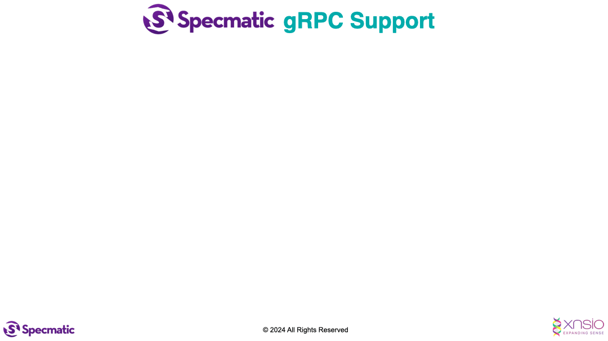

## Architecture



## Setup

### Cloning with submodules

1. Clone the repository

```shell
git clone https://github.com/znsio/specmatic-order-bff-grpc-go
```

2. Initialize and update the `proto_files` submodule

```shell
git submodule update --init --recursive --remote
```

3. Enable automatic submodule updating when executing `git pull`

```shell
git config submodule.recurse true
```

## Contract Testing BFF using specmatic-grpc docker image 

### With test containers (preferred) 

```shell
go mod tidy
go test contract_test.go -v -count=1 
```

### Running BFF Locally

#### Install Protocol Buffers Gen & BufBuild

```shell
go install google.golang.org/protobuf/cmd/protoc-gen-go@latest && \
go install google.golang.org/grpc/cmd/protoc-gen-go-grpc@latest && \
go install github.com/bufbuild/buf/cmd/buf@latest
```

#### Make the project

```shell
make clean
make all
```

#### Run the contract tests

```shell
go mod tidy
go test contract_local_test.go -v -count=1
```